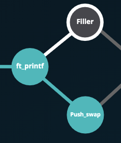
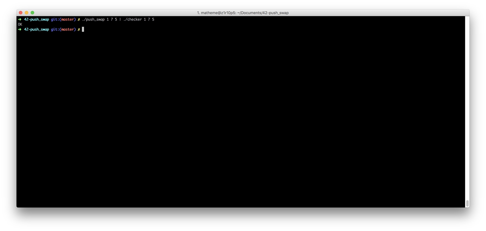
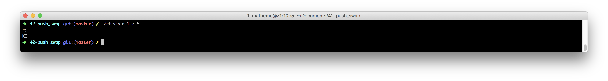
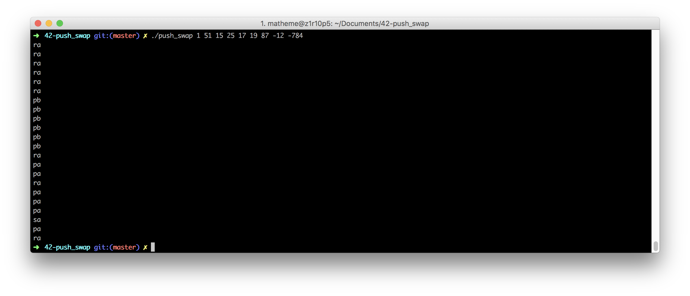
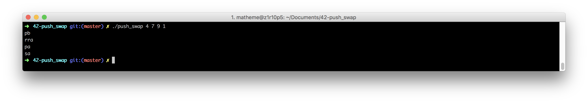

# 42-Cursus

push_swap is one of the second project of the algo branch. This project is in solo. It's about sorting

# 42-push_swap

This project involves sorting data on a stack, with a limited set of instructions, and the smallest number of moves. To make this happen, you will have to manipulate various sorting algorithms and choose the most appropriate solution(s) for optimized data sorting.

For more informations please read the subject in the folder ressources/subject

# Compiling and execute
Run the command `make` at the root of the repo then
you should have two programm :
- checker
- push_swap

# checker
this program get a number list as parameter and instruction as standard input
this program is just here for check if the output of push_swap is right
checker write `OK` if all is sort `KO` otherwise

you can run the checker like this:

# push_swap
this program get a number list as parameter.
this program sort the number list with the less instructions as possible.
the program write the result on the standard output

you can run the push_swap like this:

# instructions

sa : swap a - swap the first 2 elements at the top of stack a. Do nothing if there
is only one or no elements).
sb : swap b - swap the first 2 elements at the top of stack b. Do nothing if there
is only one or no elements).
ss : sa and sb at the same time.
pa : push a - take the first element at the top of b and put it at the top of a. Do
nothing if b is empty.
pb : push b - take the first element at the top of a and put it at the top of b. Do
nothing if a is empty.
ra : rotate a - shift up all elements of stack a by 1. The first element becomes
the last one.
rb : rotate b - shift up all elements of stack b by 1. The first element becomes
the last one.
rr : ra and rb at the same time.
rra : reverse rotate a - shift down all elements of stack a by 1. The last element
becomes the first one.
rrb : reverse rotate b - shift down all elements of stack b by 1. The last element
becomes the first one.
rrr : rra and rrb at the same time.
